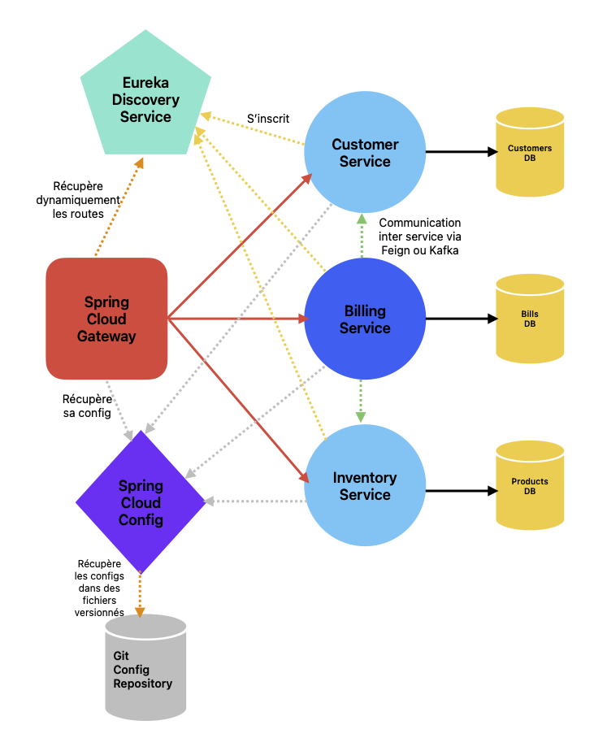

# Projet Microservices Spring Cloud avec Eureka Discovery Service
Ce projet illustre une architecture de microservices utilisant **Eureka Discovery Service**, une **Gateway**, un **Service de Configuration centralisé**, et trois **microservices métiers**.

## Architecture

L'architecture de ce projet est composée des éléments suivants :

### 1. **Eureka Discovery Service**
   - Service de découverte qui maintient une liste à jour des microservices disponibles.
   - **URL d'accès** : [http://localhost:8761/](http://localhost:8761/)

### 2. **Gateway**
   - **Point d'entrée** de toutes les requêtes externes.
   - **Rôle** : Redirige les requêtes vers les microservices appropriés en utilisant le nom du service récupéré via Eureka.
   - **URL d'accès** : [http://localhost:8888/{nom du service}/{chemin dans controller}]
   - **Fonctionnement** :
     - La Gateway interroge le serveur Eureka pour résoudre dynamiquement les routes des microservices.
     - Par exemple : une requête vers `http://localhost:8888/CUSTOMER-SERVICE/customers/getCustomers` sera automatiquement redirigée vers le service approprié basé sur son nom dans Eureka.
   - Le code de la récupération dynamique se trouve dans `GatewayApplication.java`.

### 3. **Config Service**
   - **Rôle** : Centralisation et gestion de la configuration des microservices.
   - **Dépôt des configurations** : [https://github.com/anasoualkadi/microservices-config](https://github.com/anasoualkadi/microservices-config)
   - **Fonctionnement** :
     - Le service de configuration permet aux microservices de récupérer leur configuration depuis un dépôt central (par exemple, Git).
     - Configuration par héritage : `application.yml` → `billing-service.yml` ou `application-dev.yml` → `billing-service-dev.yml` (si en mode dev).
   - **Mise à jour de la configuration sans redémarrage** :
     - Utilisation de Spring Actuator pour actualiser la configuration à la volée.
     - **URL pour actualiser la configuration** : [http://localhost:8081/actuator/refresh](http://localhost:8081/actuator/refresh)

### 4. **Microservices métiers**
   Ce projet comprend trois microservices métiers :

   - **Customer Service** : Gestion des opérations liées aux clients.
   - **Inventory Service** : Gestion de l'inventaire des produits.
   - **Billing Service** : Gestion de la facturation et communication avec les autres services via **Feign**.

   

## Utilisation de **Feign**

**Feign** est un client HTTP déclaratif, simplifiant la communication entre microservices. Dans ce projet, il est utilisé par le **Billing Service** pour interagir avec les services **Customer** et **Inventory** de manière transparente et facile à maintenir.

- **Avantages de Feign** :
  - Simplifie l'écriture des clients HTTP.
  - Intégration native avec Spring Cloud.
## Comment démarrer le projet

Pour démarrer ce projet en local :

1. **Démarrez le Eureka Discovery Service** :
   - Exécutez le service Eureka à l'adresse [http://localhost:8761/](http://localhost:8761/) pour que les microservices puissent se découvrir mutuellement.

2. **Démarrez la Gateway** :
   - Lancez le service Gateway pour qu'il serve de point d'entrée.

3. **Démarrez le Service de Configuration** :
   - Démarrez le **Config Service** pour centraliser et fournir la configuration aux microservices.

4. **Démarrez les microservices métiers** :
   - **Customer Service** : Expose les API liées aux clients.
   - **Inventory Service** : Expose les API de gestion d'inventaire.
   - **Billing Service** : Expose les API de facturation et utilise Feign pour appeler les autres services.

## Conclusion

Ce projet illustre une architecture microservices avec des composants clés tels que Eureka, Spring Cloud Gateway, Spring Cloud Config, et Feign. Il offre une solution flexible et évolutive pour le déploiement d'applications distribuées tout en maintenant une configuration centralisée et une découverte dynamique des services.
